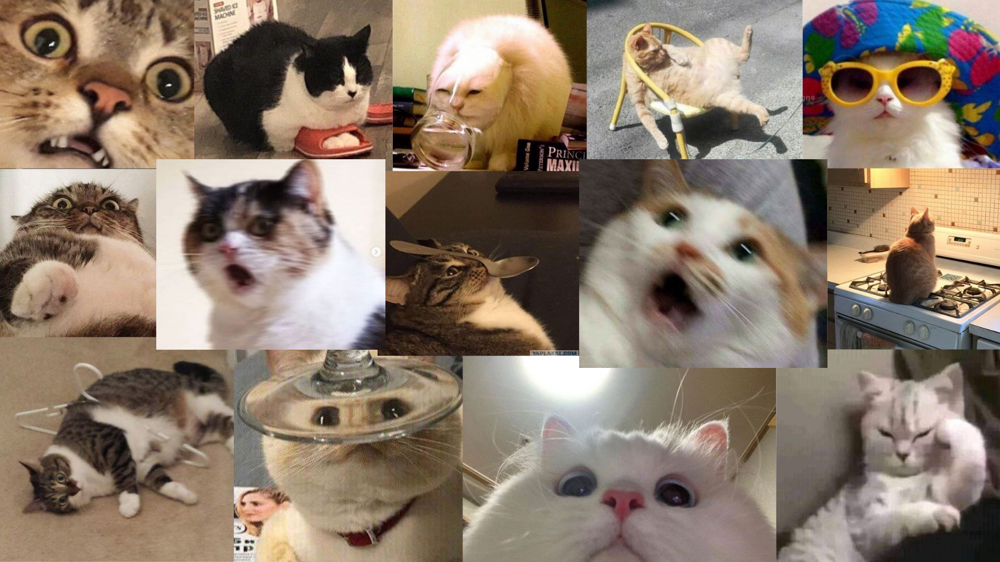

# General heading
## Second heading
### Third heading
This is a list:
- item 1
- item 2
- item 3

Ordered list:
1. item 1
2. item 2
3. item 3

> quote 

This is a code example:
```
import pandas as pd
import MyClass

x = 'zece'
print(str(x).upper())
obj = MyClass('test.txt')
```


